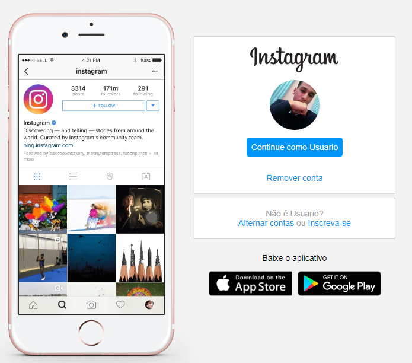

<h1 align="center">Instagram</h1>
<h2 align="center">Recriando página de login</h2>

 

• <a href="#Objetivo">Objetivo</a>
 • <a href="#Preparação">Preparação</a> 
 • <a href="#Tecnologias">Tecnologias</a>
 • <a href="#Funcionalidades-do-projeto">Funcionalidades</a>

## Objetivo 
Recriar de forma responsiva a interface de login do Instagram, colocando em pratica as habilidades adquiridas com HTML5 e CSS3.

 

## Preparação

Será necessário ter instalado uma IDE, como por exemplo o [Visual Studio Code](https://code.visualstudio.com/).

 

## Tecnologias

Foram utilizadas as seguintes tecnologias:

- <b>VScode</b>
- <b>HTML5</b>
- <b>CSS3</b>

 

